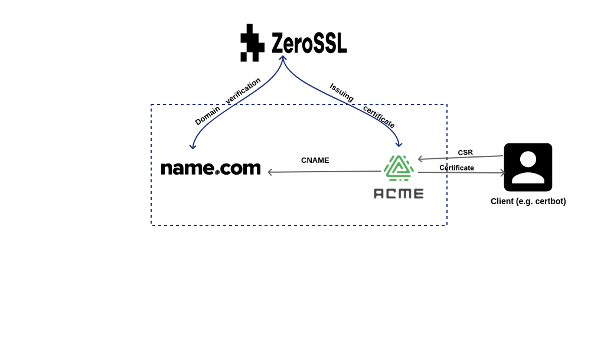

# tf-acmeserver

ACME to ZeroSSL.com REST API, based on [acme2certifier](https://github.com/grindsa/acme2certifier).

This server will enable normal ACME clients to issue certificates from non-acme servers, the main goal is to issue certificates from ZeroSSL (via REST AIP) for normal ACME clients. This will enable us to have ZeroSSL account key under one place, instead of distributing it to all clients.

## Setup

Because ACME and ZeroSSL.com require domain verification, a custom setup need to be set with a name server (CoreDNS is used here).



Certificates will be issued for sub-domains under a configured main domain, A [CA handler](https://github.com/grindsa/acme2certifier/blob/master/docs/ca_handler.md) is implemented for `acme2certifier` in [zerossl_ca_handler.py](zerossl_ca_handler.py), where it tries to issue certificates from ZeroSSL via rest API.

The full **flow** is as follows:

* Clients (e.g certbot) sends a request to the ACME server
* The custom CA handler with the ACME server will:
  * Take the client's CSR and [creates a new certificate](https://zerossl.com/documentation/api/create-certificate/).
  * Register the DNS challenge returned from the previous step in `cname_validation_p1` and `cname_validation_p2` fields as a `CNAME` record in redis (the same redis `CoreDNS` reads zone data from).
  * Ask ZeroSSL to [verify the domains](https://zerossl.com/documentation/api/verify-domains/), and waits for the result
  * If the verification is done, it will wait for the certificate to be issued for sometime, by [polling the certificate information](https://zerossl.com/documentation/api/get-certificate/) and checking for the `status`.
  * If the certificate is issued successfully, it will be returned to the user.

### Configuration

1 - [CoreDNS with redis plugin](#building-and-configuration-of-coredns): as a name server for this domain with A and NS records point to it, example:
  * A ns1-3bots.example.com
  * NS 3bots.example.com -> ns1-3bots.example.com
  
 The same goal can be achived by configuring another `CoreDNS` which manages this domain to forward `CNAME` requests to this server.

2 - [This ACME server configured with](#configuring-the-server):
  * Current domain being managed (e.g 3bots.example.com)
  * Redis server configuration (which CoreDNS will read zone data from)
  * ZeroSSL access key


## Installation

```
python3 -m pip install virtualenv --user
python3 -m virtualenv .venv
source .venv/bin/activate
pip install -r requirements.txt
```

Then run this only once:

```
python3 django_update.py
```

## Running the development server

```
python3 manage.py runserver
```

Server is configured by [acme_srv.conf](/acme/acme_srv.cfg), domain validation is disabled for now.

## Configuring the server

To configure the ACME server with ZeroSSL handler, `acme_srv.cfg` need to be placed into [acme](/acme) directory with the `CAHandler` section contains all relevant information:

```conf
[CAhandler]
# CA specific options
handler_file: zerossl_ca_handler.py
cert_validity_days: 90
zerossl_access_key: "<zerossl api access key>"
coredns_domain: "4bots.grid.tf"
coredns_redis_host: "localhost"
coredns_redis_port: 6379
```

See [acme_srv_zerossl.cf](/config/acme_srv.zerossl.cfg) for full configuration example.


## Building and configuration of CoreDNS

To build CoreDNS with redis plugin:

```bash
git clone https://github.com/coredns/coredns
cd coredns
echo 'redis:github.com/xmonader/coredns-redis' >> plugin.cfg
make
chmod +x coredns
```

An example configuration (Corefile), make sure it points to the redis host/port as the ACME server [configuration](#configuring-the-server):

```conf
. {
    redis {
        address 127.0.0.1:6379
    }
    log
    errors

    forward zerossl.com 8.8.8.8 1.1.1.1

}
```

## Deployment

WIP

## Testing with certbot (client)

You need to make sure to pass `--server` pointing to the current ACME server address, for example to get the certificate only from a local setup, where the server is running on `127.0.0.1:8000`

```
certbot certonly --server http://127.0.0.1:8000/ --standalone -d tt.example.com --cert-name tt --agree-tos -m abdo@gmail.com
```


## What's different from acme2certifier?:

Nearly all code is from acme2certifier repository, with acme implementation with django database store (db_handler)  + django server and scripts, all in one place for the ease of development/experimenting.

### List of changes:

* Copied django [db_handler.py](https://github.com/grindsa/acme2certifier/blob/master/examples/db_handler/django_handler.py) inside [acme](/acme) as `db_handler`.
* Renamed the django app module [acme](https://github.com/grindsa/acme2certifier/tree/master/examples/django/acme) to be `app` inn all relevant places to avoid import conflicts with acme implementation module.
* Updated [settings.py](/acme2certifier/settings.py) of django app to work with sqlite database instead of mysql.
* Generated keys and certificates to run the [openssl ca handler](https://github.com/grindsa/acme2certifier/blob/master/docs/openssl.md) at [acme_ca](/acme_ca) and added the configuration for it at [acme_srv.conf](/acme/acme_srv.cfg#L20).
* Used virtualenv and generated `requirements.txt` to be easier to install and run the server without complex setup.
